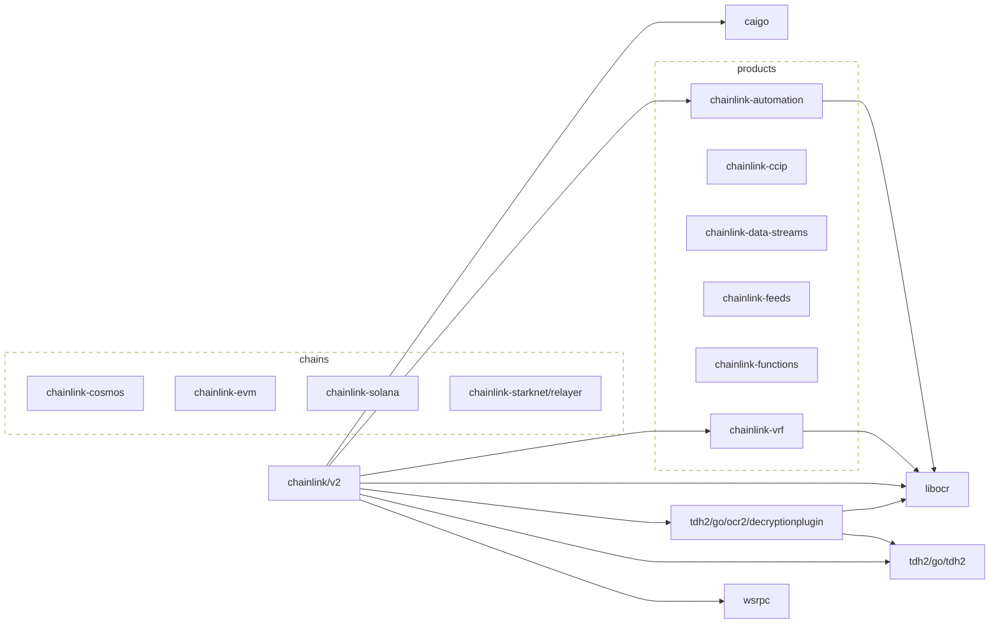

# smartcontractkit Go modules

```mermaid
flowchart LR
  subgraph chains
    chainlink-cosmos
    chainlink-evm
    chainlink-solana
    chainlink-starknet/relayer
  end

  subgraph products
    chainlink-automation
    chainlink-ccip
    chainlink-data-streams
    chainlink-feeds
    chainlink-functions
    chainlink-vrf
  end

  classDef outline stroke-dasharray:6,fill:none;
  class chains,products outline

  chainlink/v2 --> caigo
  click caigo href "https://github.com/smartcontractkit/caigo"
  chainlink/v2 --> chainlink-automation
  click chainlink-automation href "https://github.com/smartcontractkit/chainlink-automation"
  chainlink/v2 --> chainlink-vrf
  click chainlink-vrf href "https://github.com/smartcontractkit/chainlink-vrf"
  chainlink/v2 --> libocr
  click libocr href "https://github.com/smartcontractkit/libocr"
  chainlink/v2 --> tdh2/go/ocr2/decryptionplugin
  click tdh2/go/ocr2/decryptionplugin href "https://github.com/smartcontractkit/tdh2"
  chainlink/v2 --> tdh2/go/tdh2
  click tdh2/go/tdh2 href "https://github.com/smartcontractkit/tdh2"
  chainlink/v2 --> wsrpc
  click wsrpc href "https://github.com/smartcontractkit/wsrpc"
  chainlink-automation --> libocr
  chainlink-vrf --> libocr
  tdh2/go/ocr2/decryptionplugin --> libocr
  tdh2/go/ocr2/decryptionplugin --> tdh2/go/tdh2
```
